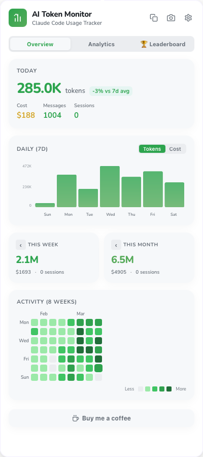
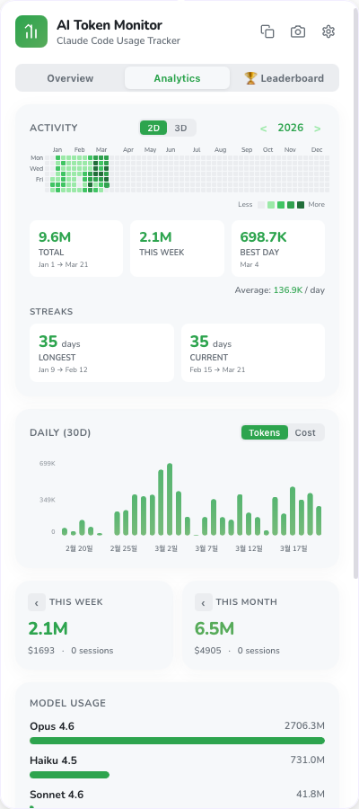

# AI Token Monitor

[](https://github.com/BetterThanAny/ai-token-monitor/releases/latest)
[](../LICENSE)

> **[English](../README.md) | [한국어](README.ko.md) | [日本語](README.ja.md) | [繁體中文](README.zh-TW.md) | [Türkçe](README.tr.md) | [Italiano](README.it.md)**

一款 macOS 和 Windows 系统托盘应用,可实时追踪 **Claude Code** 和 **Codex** 的令牌使用量、费用和活动,并支持可选 Webhook 提醒。

| 概览 | 分析 |
| :---: | :---: |
|  |  |
| 今日使用量、7 天图表、周/月汇总 | 活动图、30 天趋势、模型分析 |

## 下载

**[下载最新版本](https://github.com/BetterThanAny/ai-token-monitor/releases/latest)**

| 平台 | 文件 | 备注 |
|------|------|------|
| **macOS** (Apple Silicon) | `.dmg` | Intel Mac 即将支持 |
| **Windows** | `.exe` 安装程序 | Windows 10+(需要 WebView2,自动安装) |

## 主要功能

### 追踪与可视化
- **实时令牌追踪** — 直接解析 Claude Code / Codex 的会话 JSONL 文件,准确统计使用量
- **多提供商支持** — 在 Claude / Codex 之间切换,每个提供商使用独立的价格模型
- **多配置目录** — 可同时添加多个 Claude/Codex 根目录,聚合工作与个人帐号的使用量
- **日图表** — 7/30 天令牌或费用柱状图(含 Y 轴标签)
- **活动图** — GitHub 风格贡献热力图(支持 2D/3D 切换与按年浏览)
- **周期导航** — 使用 `< >` 箭头浏览过去的周/月汇总
- **模型分析** — Input/Output/Cache 比例可视化
- **缓存效率** — 缓存命中率环形图

### 社交与分享
- **AI 报告 (Wrapped)** — 月度/年度回顾卡片(最常用模型、最忙碌的一天、连续记录)
- **收据视图** — 今日 / 本周 / 本月 / 全部 的收据式使用摘要
- **薪资对比** — 将 AI 支出换算为月薪占比(拿铁 / Netflix / 炸鸡)
- **分享与导出** — 通过顶栏菜单复制 Markdown 摘要、截图或应用分享消息

### 提醒
- **托盘费用** — 在托盘图标旁显示今日费用(macOS 菜单栏标题,Windows 工具提示)
- **Webhook 通知** — 用量达到阈值或重置时通过 Discord / Slack / Telegram 通知
- **自动更新器** — 应用内更新提示,含下载进度

### 自定义
- **4 种主题** — GitHub(绿色)、Purple、Ocean、Sunset,并支持自动/浅色/深色模式
- **10 种语言** — English, 한국어, 日本語, 简体中文, 繁體中文, Français, Español, Deutsch, Türkçe, Italiano
- **数字格式** — 紧凑(`377.0K`)/ 完整(`377,000`)切换
- **开机自启** — 可选开机自动启动
- **自动隐藏** — 点击窗口外自动隐藏

## 从源码安装

### 前提条件

- [Node.js](https://nodejs.org/) 18+
- [Rust](https://rustup.rs/) 工具链
- [Tauri CLI v2](https://v2.tauri.app/start/prerequisites/)
- 已安装 [Claude Code](https://claude.ai/claude-code) 或 [Codex](https://openai.com/index/introducing-codex/) 中至少一个,并且至少使用过一次

### 构建

```bash
git clone https://github.com/BetterThanAny/ai-token-monitor.git
cd ai-token-monitor
npm install
npm run tauri dev     # 开发模式
npm run tauri build   # 生产构建
```

## 使用方法

### 基本操作

1. 启动应用后,系统托盘(macOS 菜单栏 / Windows 任务栏)中会出现图标
2. 点击图标打开使用量仪表板
3. 在 **概览** 和 **分析** 标签之间切换

### 标签说明

| 标签 | 内容 |
|------|------|
| **概览** | 今日摘要、7 天图表、周/月汇总、8 周热力图 |
| **分析** | 全年活动图(2D/3D)、30 天图表、模型分析、缓存效率 |

### 设置

设置分为 3 个标签:

| 标签 | 选项 |
|------|------|
| **常规** | 主题、语言、外观、数字格式、菜单栏费用、开机自启、月薪、可选 Claude 用量追踪 |
| **账户** | Claude/Codex 配置目录 |
| **Webhooks** | Discord / Slack / Telegram Webhook URL、提醒阈值、监控窗口、重置通知 |

## 数据源

| 提供商 | 路径 | 备注 |
|--------|------|------|
| **Claude Code** | `~/.claude/projects/**/*.jsonl` | 从 `~/.claude/stats-cache.json` 补充会话/工具调用数。支持多根目录。 |
| **Codex** | `~/.codex/sessions/**/*.jsonl` | 支持多根目录。Windows 上还会通过 `\\wsl.localhost\...` / `\\wsl$\...` 自动发现可访问的 WSL Codex 主目录,因为 Windows 原生 Codex 默认使用 `%USERPROFILE%\.codex`,而 WSL 中的 Codex 默认使用 Linux home。既有 JSONL 不可靠记录历史 session 使用的是 Fast 还是 Standard，因此 ai-token-monitor 不能仅凭源数据自动恢复这个区别。 |

## 架构

```
┌────────────────────────────────────┐
│  前端 (React 19 + Vite)            │
│  ├── PopoverShell / Header         │
│  ├── TabBar (2 tabs)               │
│  ├── TodaySummary / DailyChart     │
│  ├── ActivityGraph (2D/3D) / Heatmap│
│  ├── ModelBreakdown / CacheEfficiency│
│  ├── SalaryComparator              │
│  └── SettingsOverlay (3 tabs)      │
├────────────────────────────────────┤
│  后端 (Tauri v2 / Rust)            │
│  ├── JSONL 会话解析器 (Claude/Codex)│
│  ├── 文件监视 (notify)             │
│  ├── 托盘图标 + 费用显示           │
│  ├── 自动更新器                    │
│  ├── Webhook 分发器                │
│  └── 偏好设置 + 加密密钥           │
├────────────────────────────────────┤
│  外部服务 (可选)                   │
│  └── Discord / Slack / Telegram    │
└────────────────────────────────────┘
```

## 平台支持

| 平台 | 状态 | 备注 |
|------|------|------|
| **macOS** | 支持 | 菜单栏集成、隐藏 Dock、托盘费用标题 |
| **Windows** | 支持 | 系统托盘集成、NSIS 安装程序、工具提示费用显示 |
| **Linux** | 未测试 | Tauri 支持 Linux,基本功能可能可用 |

## 支持

如果您觉得此项目有用,请考虑 [请我喝杯咖啡](https://ctee.kr/place/programmingzombie)。

## 许可证

MIT
